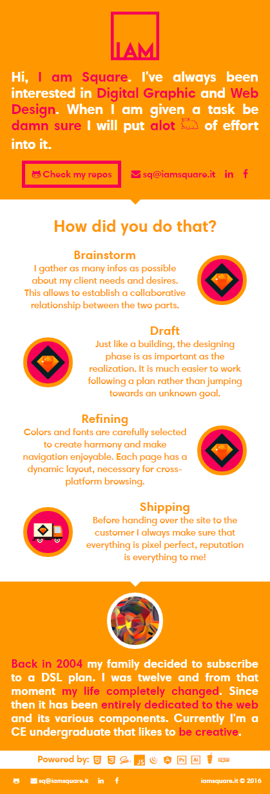
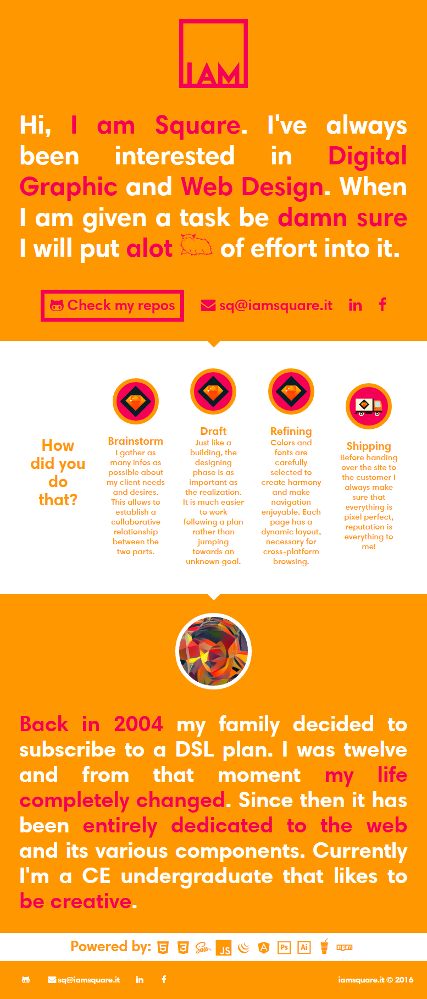
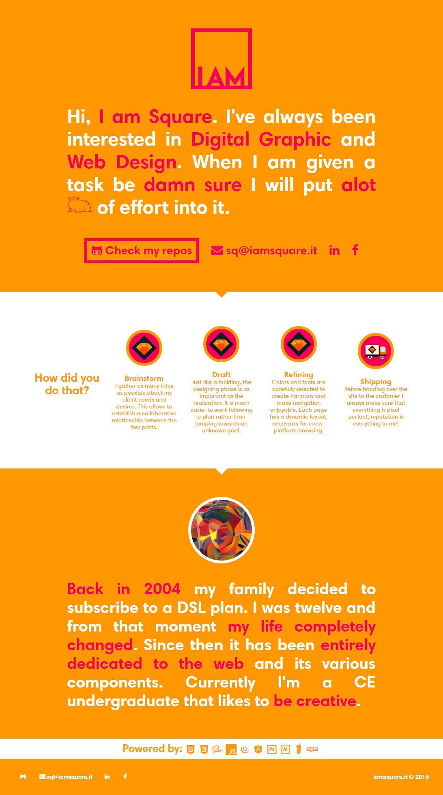
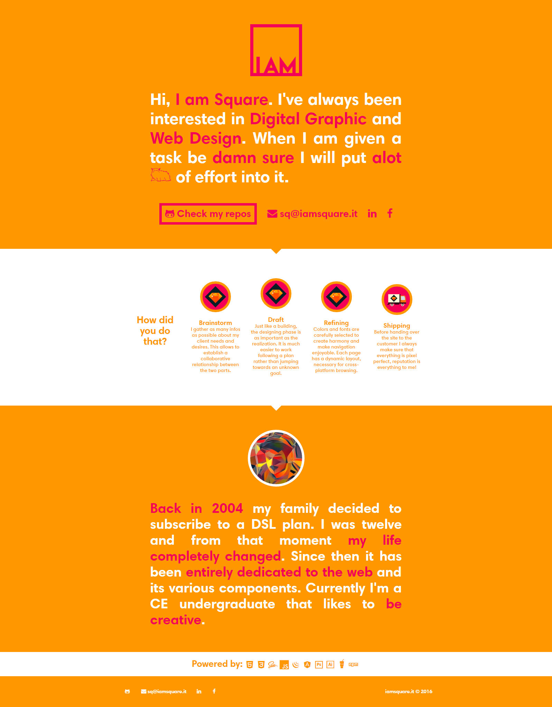

# iamsquare-rebrand
Personal page source code

Uses Sass (SCSS), bonzo and qwery (instead of jQuery).

### Preview - 5th September 2016:
####Mobile

####Tablet

####Desktop (small)

####Desktop (large)

